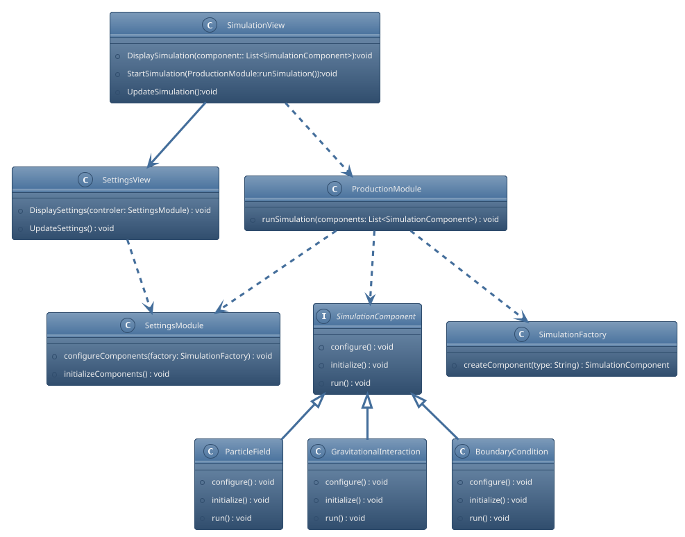

```plantuml 
@startuml SimulationFactory
!theme spacelab

!define PARTICLE class :Particle;
!define GRAVITY class :GravitationalInteraction;
!define BOUNDARY class :BoundaryCondition;

interface SimulationComponent {
  +configure() : void
  +initialize() : void
  +run() : void
}

class ParticleField {
  +configure() : void
  +initialize() : void
  +run() : void
}

class GravitationalInteraction {
  +configure() : void
  +initialize() : void
  +run() : void
}

class BoundaryCondition {
  +configure() : void
  +initialize() : void
  +run() : void
}

class SimulationFactory {
  +createComponent(type: String) : SimulationComponent
}

class SettingsModule {
  +configureComponents(factory: SimulationFactory) : void
  +initializeComponents() : void
}

class SettingsView {
  +DisplaySettings(controler: SettingsModule) : void
  +UpdateSettings() : void
}


class ProductionModule {
  +runSimulation(components: List<SimulationComponent>) : void
}
class SimulationView{
 +DisplaySimulation(component:: List<SimulationComponent>):void
 +StartSimulation(ProductionModule:runSimulation()):void
 +UpdateSimulation():void
}
SimulationComponent <|-- ParticleField
SimulationComponent <|-- GravitationalInteraction
SimulationComponent <|-- BoundaryCondition

ProductionModule ..> SimulationFactory : Creates
ProductionModule ..> SettingsModule : Uses
ProductionModule ..> SimulationComponent : Uses
SettingsView ..> SettingsModule: Uses
SimulationView ..>ProductionModule:Uses
SimulationView-->SettingsView: Associate

@enduml
```