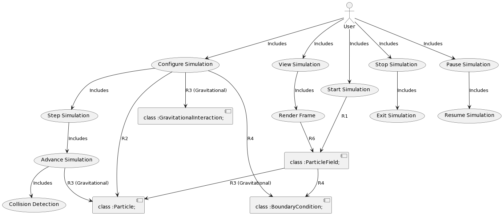

# Requirement specification iteration 1

## Requirement Prompt

Make a requirement matrix for the following project. 

The project is to be implemented in Python using TDD: 
The program should visually display a number of particles on a field. 
Particles are initialised with a certain position and speed. 
Each particle interacts with all the other particles in a simple way, 
e.g. gravitational attraction, Lennard-Jones potential, 
direction alignment (implementing a flocking behaviour), 
or something else, the group chooses which. 
Decide on a boundary condition (e.g. bounce or wrap or eliminate the particle). 
The simulation is then stepped forward, drawing each step, until stopped. 
The goal is to create a stable simulation capable 
of the maximum number of particles at an acceptable framerate.

## Result

| Requirement ID | Requirement Description | Acceptance Criteria | Test Cases |
|----------------|-------------------------|---------------------|------------|
| R1             | Visual Display          | The program must display a field with particles | - Verify that the program opens a graphical window or interface for displaying particles. |
| R2             | Particle Initialization | Particles must be initialized with positions and speeds | - Confirm that each particle has a unique position and speed. |
| R3             | Particle Interaction    | Particles must interact with each other | - Implement a chosen interaction (e.g., gravitational attraction, Lennard-Jones potential, or direction alignment). - Verify that particles respond to each other's presence. |
| R4             | Boundary Condition      | Choose a boundary condition for the field | - Implement chosen boundary conditions (e.g., bounce, wrap, or elimination). - Confirm that particles behave according to the chosen boundary conditions. |
| R5             | Simulation Step         | The simulation must progress in discrete steps | - Implement a mechanism to advance the simulation step by step. |
| R6             | Real-time Visualization | Draw each simulation step in real-time | - Ensure that the simulation displays each step visually as it progresses. |
| R7             | Maximum Particle Limit  | The simulation should handle a maximum number of particles | - Test the simulation with varying numbers of particles up to the maximum limit and verify that it remains stable. |
| R8             | Acceptable Framerate    | The simulation should maintain an acceptable framerate | - Measure and verify that the framerate remains above a defined threshold with the maximum number of particles. |
| R9             | Stop Simulation         | Ability to stop the simulation | - Implement a user interface or mechanism to stop the simulation. |
| R10            | Test-Driven Development | Develop the project using TDD | - Write test cases before implementing each feature or functionality. - Ensure that the tests pass after implementing the code. |

From this matrix we build derived requirements using the following prompt: 
generate derived requirements from the requirement matrix

#### Derived Requirement 1: Particle Visualization (Derived from R1)
The program must display particles as small, colored circles on the field.
Particles should be visually distinguishable from the field background.
Particle colors must represent their properties or states (e.g., speed, type, status).

#### Derived Requirement 2: Particle Initialization (Derived from R2)
Particles should be initialized within a specified area of the field.
Initial positions and speeds of particles should be random or configurable.
Ensure that particles are evenly distributed across the field to avoid clumping.

#### Derived Requirement 3: Interaction Mechanism (Derived from R3)
Implement multiple interaction mechanisms that can be selected or 
combined (e.g., gravitational attraction, Lennard-Jones potential, 
and direction alignment).
Parameters for each interaction mechanism (e.g., gravitational constant, 
interaction radius) should be adjustable.

#### Derived Requirement 4: Boundary Conditions (Derived from R4)
Allow users to choose from multiple boundary conditions, 
including bounce, wrap, or elimination.
Boundary conditions should be easily configurable and switchable during the simulation.

#### Derived Requirement 5: Simulation Control (Derived from R5)
Provide simulation control options such as play, pause, step, and reset.
Allow users to specify the simulation step size (e.g., time step).
Ensure the simulation is responsive to user input for real-time adjustments.

#### Derived Requirement 6: Performance Optimization (Derived from R7 and R8)
Implement performance optimization techniques to handle a maximum number of particles while maintaining an acceptable framerate.
Define a clear threshold for an "acceptable framerate" and ensure that the simulation meets or exceeds it with the maximum number of particles.

#### Derived Requirement 7: User Interface (Derived from R9)
Design an intuitive user interface (UI) for starting and stopping the simulation.
Include options for adjusting simulation parameters and visual settings.
Provide clear feedback to users on the status of the simulation.

#### Derived Requirement 8: Version Control and Collaboration (Derived from R10)
Use version control systems (e.g., Git) to manage the project's source code.
Collaborate effectively among team members using tools like issue tracking systems and code review processes.
Ensure that test cases and documentation are kept up to date as the project evolves.

## USECASE MODEL

