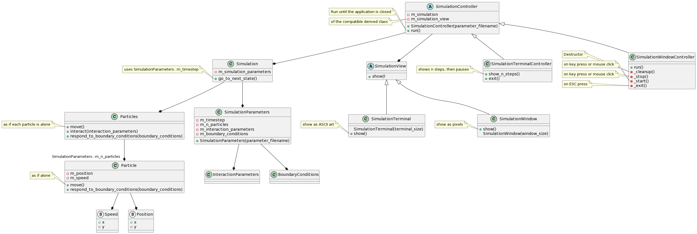

# Design documents

Number|Document                                                              |Description
------|----------------------------------------------------------------------|------------------------------------------------
1     |[Client Project Brief](client_project_brief.md)                       |The start of a design, written by the client
2     |[Project documentation](Example_project_designProcessDocumentation.md)|General exercise for `3a` and `4a`
3a    |[DPD unassisted](DPD_unassisted.md)                                   |The exercise to create the formal design
3b    |[DPUA requirements specification](DPUA_requirementspecification.md)   |The requirements specification, the result of `3a`
4a    |[DPD assisted](DPD_assisted.md)                                       |The exercise to create DPAI. It is part of the course
4b    |**[DPAI requirements](DPAI_requirements.md)**                         |The requirements specification, the result of `4a`
5     |[Class diagram, AI assisted](CDAI_MVC_Simulation.md)                  |The class diagram, assisted by AI, follows from the use case diagram
6     |[Class diagram, by humans](CDUA_class_diagram_richel_20231116.md)     |The class diagram, created by humans, follows from the use case diagram


We use both console application (written by humans) and a GUI application 
(written by AI). The GUI package is PyGame.

## Abbreviations

Abbreviation|Full
------------|--------------------------------------
CDAI        |Class Design assisted by Artificial Intelligence 
DPAI        |Design Process Artificial Intelligence 
DPD         |Design Process Document
DPUA        |Design Process UnAssisted

## Usecase model


## Class diagram

### Current iteration of the class diagram



Or [view the PlantUML](class_diagram_richel.puml)

### Initial design of the class diagram

```
classDiagram

class Simulation

class SimulationView
class SimulationTerminal
class SimulationWindow

class SimulationController
class SimulationTerminalController
class SimulationWindowController

class SimulationParameters
class Particles
class Particle
class Velocity
class Position

SimulationController --* Simulation
SimulationController --* SimulationView

Simulation --* SimulationParameters
SimulationParameters --* InteractionParameters
SimulationParameters --* BoundaryConditions

Simulation --* Particles
Particles --* "SimulationParameters::m_n_particles" Particle

Particle --* Velocity
Particle --* Position


SimulationView <|-- SimulationTerminal
SimulationView <|-- SimulationWindow

SimulationController <|-- SimulationTerminalController
SimulationController <|-- SimulationWindowController

class SimulationParameters {
  + SimulationParameters(parameter_filename)
  - m_timestep
  - m_n_particles
  - m_interaction_parameters
  - m_boundary_conditions
}

class Simulation {
  + go_to_next_state()
  - m_simulation_parameters
}

note for Simulation "uses SimulationParameters::m_timestep"

class Particles {
  + move()
  + interact(interaction_parameters)
  + respond_to_boundary_conditions(boundary_conditions)
}

note for Particles "'move' as if each particle is alone"

class Particle {
  + move()
  + respond_to_boundary_conditions(boundary_conditions)

  - m_position
  - m_velocity
}

note for Particle "'move' as if alone"

class SimulationView {
  + show()
}

class SimulationTerminal {
  SimulationTerminal(terminal_size)
  + show()
}

note for SimulationTerminal "'show' show as ASCII art"

class SimulationWindow {
  + show()
  SimulationWindow(window_size)
}

note for SimulationWindow "'show' show as pixels"

class SimulationController {
  + SimulationController(parameter_filename)
  + run()
  + exit()
  - m_simulation
  - m_simulation_view
}

note for SimulationController "'m_simulation_view' of the compatible derived class"

class SimulationTerminalController {
  + show_n_steps()
  + exit()
}

note for SimulationTerminalController "'show_n_steps' shows n steps, then pauses"

class SimulationWindowController {
  + stop()
  + start()
  + exit()
}

note for SimulationWindowController "'start' on key press or mouse click"

note for SimulationWindowController "'stop' on key press or mouse click"

note for SimulationWindowController "'exit' on ESC press"
```
