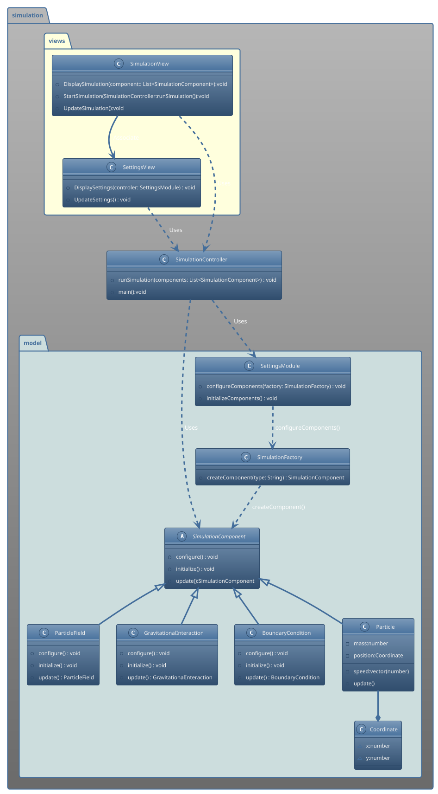

#Class Diagram example NBodyProblem

@Designer: Lars Eklund, ChatGPT

This is an example of how one could generate and build a class diagram for the NBody simulation. 
The process started with prompting the Ai to generate a class diagram of the  
UseCase diagram previously created. Then ChatGPT created a rough draft,
 which was manually changed to correct mistakes that the AI (ChatGPT) had generated and to added missing parts like the package(module)and changed an interface to an abstract class. This Design uses a strict MVC design pattern and a Factory Method Design Pattern to create the simulation, this is a rather complicated design for such a small project and implementation from this track might not be recommended for this project but is included for educational purposes.

classes.
