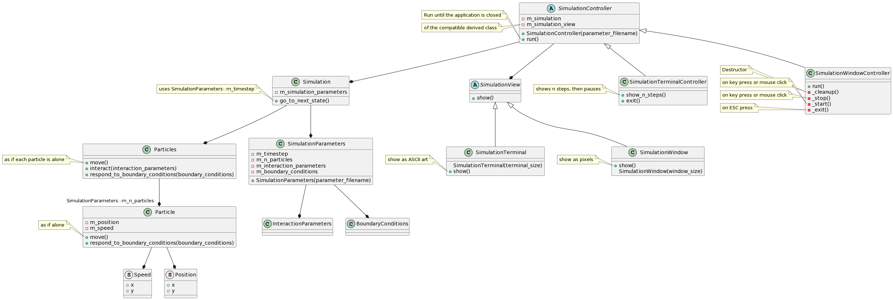
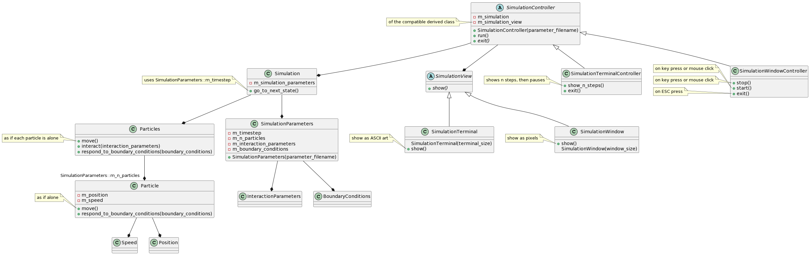

# Design documents

Number|Document                                                              |Description
------|----------------------------------------------------------------------|------------------------------------------------
1     |[Client Project Brief](client_project_brief.md)                       |The start of a design, written by the client
2     |[Project documentation](Example_project_designProcessDocumentation.md)|General exercise for `3a` and `4a`
3a    |[DPD unassisted](DPD_unassisted.md)                                   |The exercise to create the formal design
3b    |[DPUA requirements specification](DPUA_requirementspecification.md)   |The requirements specification, the result of `3a`
4a    |[DPD assisted](DPD_assisted.md)                                       |The exercise to create DPAI. It is part of the course
4b    |**[DPAI requirements](DPAI_requirements.md)**                         |The requirements specification, the result of `4a`
5     |[Class diagram, AI assisted](CDAI_MVC_Simulation.md)                  |The class diagram, assisted by AI, follows from the use case diagram
6     |[Class diagram, by humans](CDUA_class_diagram_richel_20231116.md)     |The class diagram, created by humans, follows from the use case diagram

We use both console application (written by humans) and a GUI application 
(written by AI). The GUI package is PyGame.

## Abbreviations

Abbreviation|Full
------------|--------------------------------------
CDAI        |Class Design assisted by Artificial Intelligence 
DPAI        |Design Process Artificial Intelligence 
DPD         |Design Process Document
DPUA        |Design Process UnAssisted

## Usecase model

## Class diagram

### Current iteration of the class diagram

Or [view the PlantUML](class_diagram_richel.puml)

### Initial design of the class diagram

Or [view the PlantUML](class_diagram_richel_20231116.puml)
